<script type="text/javascript" src="http://cdn.mathjax.org/mathjax/latest/MathJax.js?config=TeX-AMS-MML_HTMLorMML"></script>
<script type="text/x-mathjax-config"> MathJax.Hub.Config({ tex2jax: {inlineMath: [['$', '$']]}, messageStyle: "none" });</script>

# **Eightfold AI : Innov8 challenge**
## Team Name: ChadGPT 
A **resume highlighter**, which given a query highlights the relevant phrases from the resume, saving a lot of time of the recruiter. We have also created a HTML website, for ease of the user, and a question-answering system tailored for the particular resume uploaded.


## **Approach**
---
We have followed the following approach :

* The pdf was converted to text using the `PyMUPDF` library and instead of tokenizing this corpus, we instead split the corpus based on bullet points and other special starting symbols, which hold significance in a resume.

* Our method is based on the principle of [**_cosine similarity_**](https://en.wikipedia.org/wiki/Cosine_similarity), but instead of using word2vec/GloVe, we have used [**_transformers_**](https://en.wikipedia.org/wiki/Transformer_(deep_learning_architecture)) for converting the sentences to vectors. This has been done using three different LLM's and there results have been aggregated to get the best of all of them.

* The description of the models are as follows:
    * **M1:**  `en_core_web_md` by spaCy is an open-source CNN-based language model, which is converting query and sentences to vectors based on its semantic structure.
    * **M2:** `all-MiniLM-L6-v2` is a sentence-transformer freely available on [hugging face](https://huggingface.co/sentence-transformers/all-MiniLM-L6-v2).
    * **M3:** `paraphrase-multilingual-MiniLM-L12-v2` is also a sentence-transformer available on [hugging face](https://huggingface.co/sentence-transformers/paraphrase-multilingual-MiniLM-L12-v2).

* Although, each model is doing the same thing, but after few experiments, it was found that each model is able to catch something which others aren't as each of the model were fine tuned for different tasks on different sets of data. So, a weighted average of these three similiarities were taken after normalizing the scores using this function:
```python
def normalize_scores(scores):
    min_score = min(score for sentence, score in scores)
    max_score = max(score for sentence, score in scores)
    normalized_scores = [(sentence, (score - min_score) / (max_score - min_score)) for sentence, score in scores]
    return normalized_scores
```
* The reason they were normalized is because different models give their most relevant sentences different scores, so for taking average all were brought in the range **[0,1]** with 1 as the highest scorer and 0 as the lowest.
* The weightage for M1,M2,M3 was selected empirically to be 20:60:20, which was based purely on experiment basis. It is suggested that various other ratios can be tried, but M2 was found to be more relevant, hence a greater weightage was given to it.
* We were getting dates as a highlight for various prompts, so it was handled separately, by explicitly removing it using the 3-folded approach above.

* The sentences after this 3-folded process and manual sorting has then been sorted in decreasing order of similarity scores, and the resume is highlighted using the following color coding:
    * **Very light orange**: Sentences having scores in the top 5% have been highlighted with this color.
    * **Light Yellow**: Sentences having scores among top 5-10% have been highlighted with this color.
    * **Very light Yellow**: Sentences having scores among top 10-15% have been highlighted with this color.


## **Results on sample resumes**
---
We have ran our tool on some test resumes and received the following results. The complete results are included in the submission.

<center>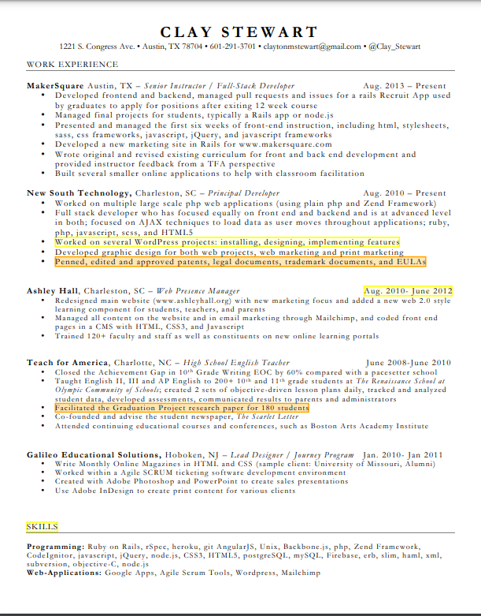</center>
<center>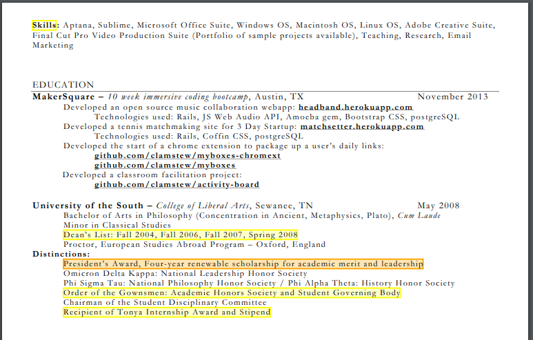</center>
      <center>Resume queried with "Notable achievements" </center>

<br/>


<center>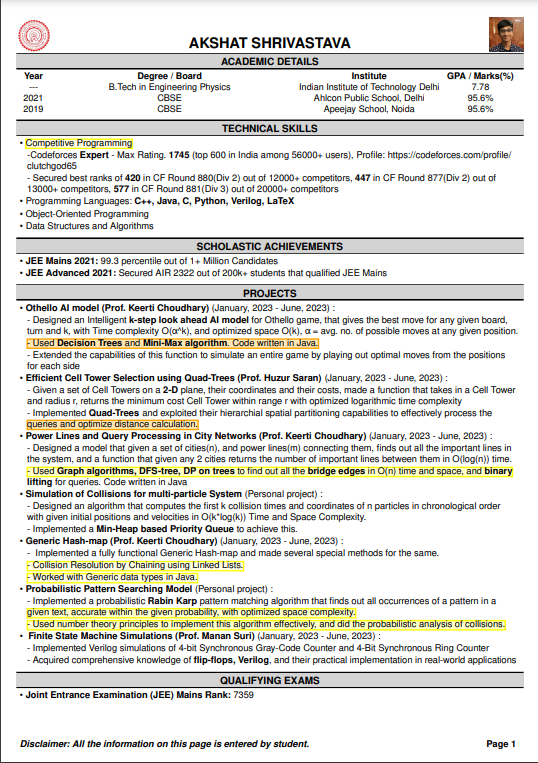</center>
      <center>Resume queried with "Proficiency in Data Structures and Algorithms" </center>


<br/>

<center>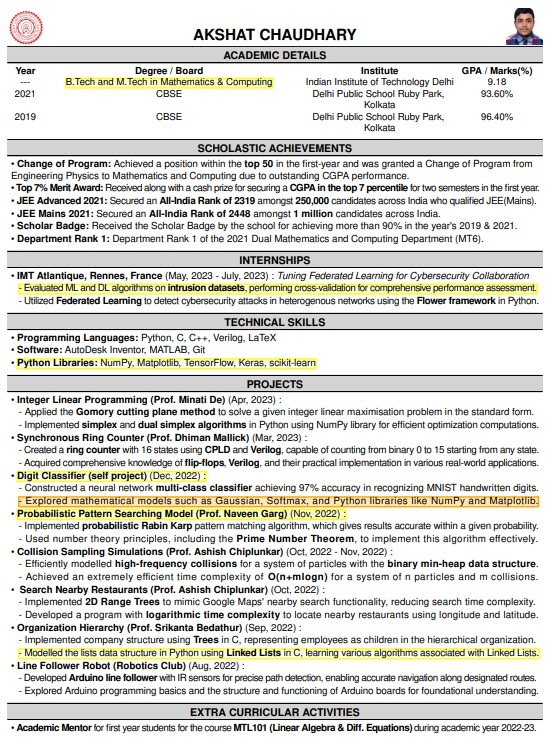</center>
<center>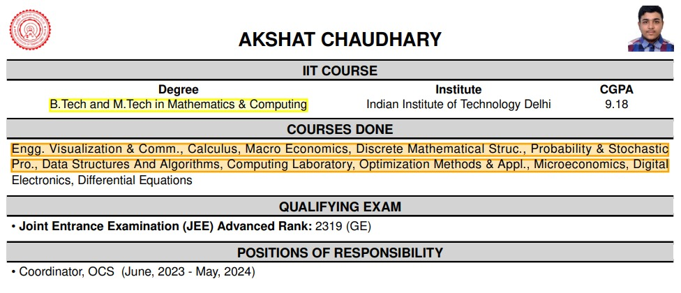</center>
      <center>Resume queried with "Machine Learning/Data Science" </center>
<br/>
As it is clearly visible, the model works pretty well, more outputs have been provided in the submission link.

## **Bonus Tasks**

We also built a basic HTML interface which eases the task, one can just upload the resume and enter the query, and the corresponding output file will be downloaded.
Some snippets of the website:

<center>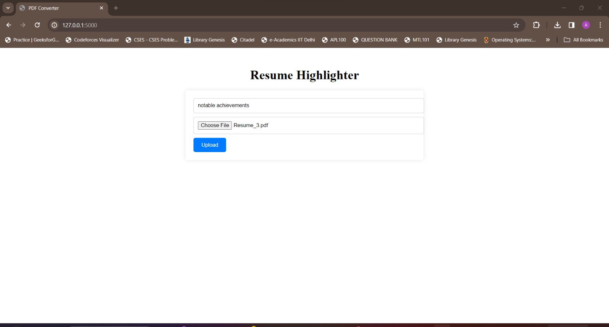</center>
<center>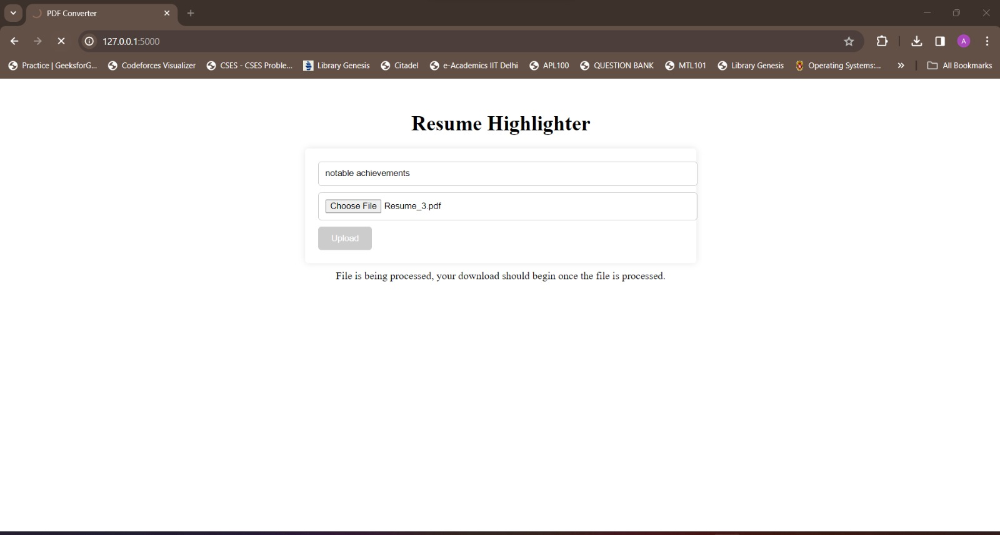</center>
<center>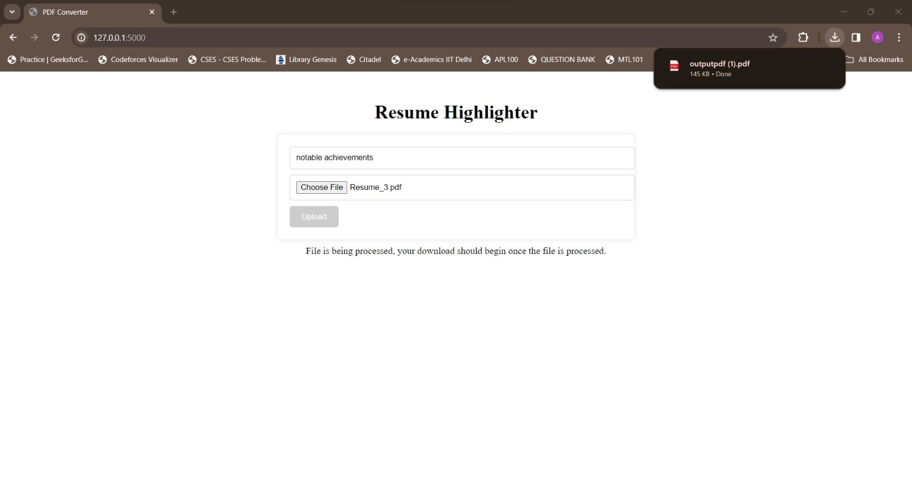</center>

<br/>
Code for the same has been provided.
<br/>

# Task 2

We also built a question-answering system, which can answer based on the uploaded resume using Hugging Face `pipeline('question-answering')`. The question will be provided as input in the notebook itself, and for the context we have used the top 10 relevant sentences from our 3-fold model with the question as the query. Snippets of some results:

<center>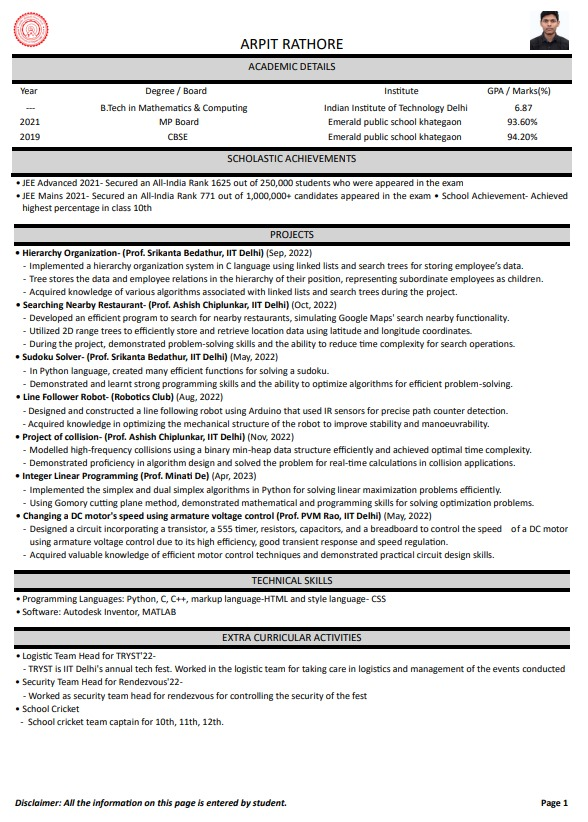</center>
      <center>Resume of the candidate </center>

<br/>

<center>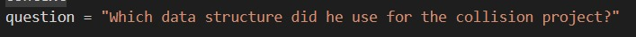</center>  
<center>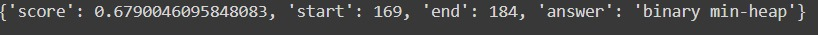</center>

<br/>

As it can be seen, the result is pretty accurate even for a specific question targeting on a particular part of the resume.
    